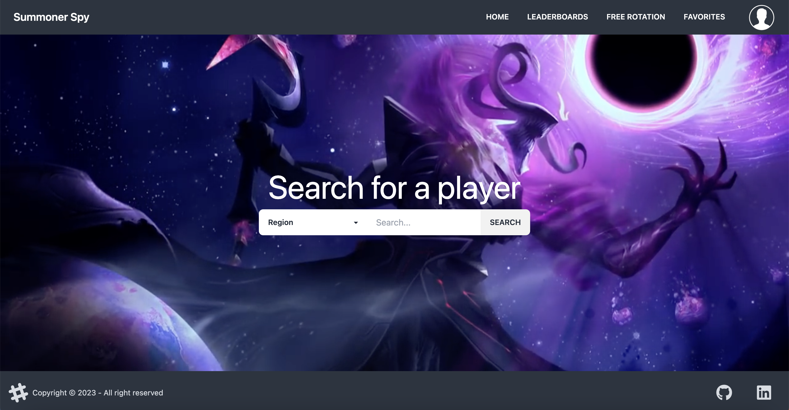

<h1 align="center">Summoner Spy</h1>

  <h3>
    <a href="https://summoner-spy.vercel.app/">
      Demo
    </a>
  </h3>

<!-- TABLE OF CONTENTS -->

## Table of Contents

- [Overview](#overview)
  - [Built With](#built-with)
- [Contact](#contact)

<!-- OVERVIEW -->

## Overview

SummonerSpy is an API project that allows you to check your rank, statistics, and detailed match history page for League of Legends. It is built using Angular, Node, Tailwind, and Firebase, which are modern web development tools and technologies. SummonerSpy is a great tool for League of Legends players who want to keep track of their gaming progress and learn how they can improve their gameplay.

### Built With

- [Angular](https://angular.io/)
- [Tailwind](https://tailwindcss.com/) ([DaisyUI](https://daisyui.com/))
- [Firebase](https://firebase.google.com/)
- [ExpressJS](https://expressjs.com/)

## Contact

- GitHub [@marinactonci](https://github.com/marinactonci)
- LinkedIn [Tonči Marinac](https://www.linkedin.com/in/marinactonci/)
- Instagram [@marinactonci](https://instagram.com/marinactonci)
